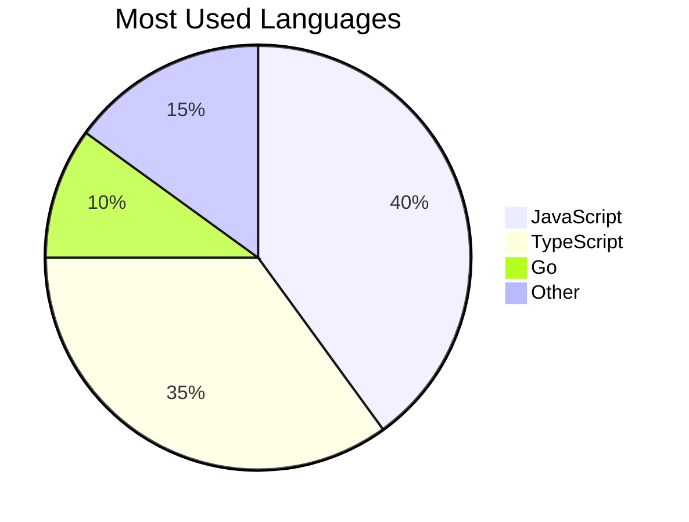

<!-- Profile README for truph77 - Colorful, Professional & Interactive UI with MOI the Cat -->

<p align="center">
  
</p>

<p align="center">
  
  <br/>
  <b style="font-size:1.2em; color:#495867;">Professional Software Engineer | Cloud Solutions | Open Source Advocate</b>
</p>

---

<div align="center">
  
</div>

---

## ✨ About Me

<div align="center">

<table>
  <tr>
    <td align="center"></td>
    <td>
      <ul>
        <li>🔹 <b>Cloud Native & Automation Specialist</b></li>
        <li>🔹 <b>Languages:</b> Python, JavaScript, TypeScript, Go</li>
        <li>🔹 <b>Focus:</b> Distributed Systems, DevOps, Data Engineering</li>
        <li>🔹 <b>Fun fact:</b> I'm passionate about beautiful code and beautiful UIs!</li>
      </ul>
    </td>
  </tr>
</table>

</div>

---

## 🐾 Meet MOI the Cat!

<p align="center">
  
</p>
<p align="center">
  <b>MOI</b> is my adorable virtual cat!  
  <br>I'm always feeding and taking care of Moi while coding.<br>
  <i>Want to give Moi a snack? Just leave a 🐟 in your comment!</i>
</p>

---

## 🛠️ Tech Stack

<p align="center">
  
  
  
  
  
  
  
  
  
</p>

---

## 📈 GitHub Stats & Languages

<div align="center">
  
  
</div>

---

## 🎮 Mini Game: Guess the Number

> 🌈 I’m thinking of a number between 1 and 10.  
> Can you guess it?  
> <details>
> <summary><b>Click to reveal the answer!</b></summary>
> 🎉 It's <b style="color:#F48C06;">7</b>! Did you guess it right?
> </details>

---

## 🧩 Fun: Colorful Maze

```
🟧🟦🟦🟦🟦
🟦⬜⬜🟦🟦
🟦🟦⬜🟦🟦
🟦⬜⬜⬜🟦
🟦🟦🟦🟧🟦
```
<sub>Can you find the path from the orange box on the left to the one on the right?</sub>

---

## 🧠 Quick Quiz

> **What is the output of:**  
> `print("Hello" * 2 + "World")`  
> <details>
> <summary><b>Show Answer</b></summary>
> <b style="color:#43AA8B;">HelloHelloWorld</b>
> </details>

---

## 🎨 Language Usage



---

## 📬 Connect with Me

<p align="center">
  <a href="mailto:trung242.dev@gmail.com">
    
  </a>
  <a href="https://github.com/truph77">
    
  </a>
  <a href="https://www.linkedin.com/in/trungpham242/">
    
  </a>
</p>

---

<p align="center" style="font-size:1.15em; color:#495867;">
  &nbsp;
  <b>Thanks for visiting! Happy coding!</b> 🚀
</p>